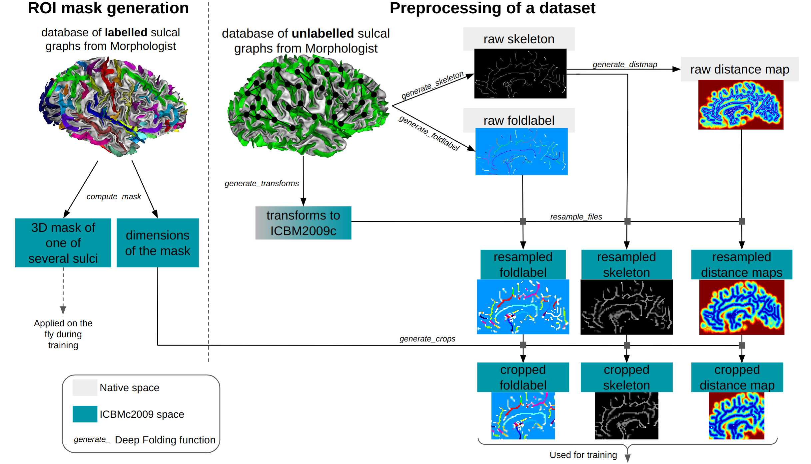

Deep folding
------------

The project aims to study cortical folding patterns thanks to deep learning tools.
MRIs are processed through BrainVISA/Morphologist tools.

Prerequisites
-------------

Brainvisa parts (deep_folding.brainvisa) must run with brainvisa installed (see steps below)

Package documentation can be found at `https://neurospin.github.io/deep_folding/index.html <https://neurospin.github.io/deep_folding/index.html>`_.

Generates datasets of crops
---------------------------

Deep learning pipelines to investigate folding patterns are not working on the whole brain (or the whole hemisphere) but on brain crops.
Several processings are required, as drawn here:

 
We give a step-by-step description of the pipeline in `<deep_folding/brainvisa/README.rst>`_.

The pixi way (recommended)
--------------------------

First install aims, anatomist and morphologist library:

.. code-block:: shell

  # First install pixi (no need to be root) if it is not installed
  curl -fsSL https://pixi.sh/install.sh | bash
  source ~/.bashrc
  
  # Create the pixi environment
  
  mkdir env_pixi
  cd env_pixi
  pixi init -c conda-forge -c https://brainvisa.info/neuro-forge
  pixi add anatomist soma-env=0.0 morphologist pip ipykernel 

Then, activate the pixi shell and install deep_folding:

.. code-block:: shell

  pixi shell
  # Install deep_folding
  git clone https://github.com/neurospin/deep_folding.git
  cd deep_folding
  SKLEARN_ALLOW_DEPRECATED_SKLEARN_PACKAGE_INSTALL=True pip3 install -e .
  
  # Launch the tests to check the installation
  python3 -m pytest

Development
-----------

.. code-block:: shell

    git clone https://github.com/neurospin/deep_folding.git

    # Install for development
    bv bash
    cd deep_folding
    virtualenv --python=python3 --system-site-packages venv
    . venv/bin/activate
    # To avoid the scikit-learn naming error use 
    SKLEARN_ALLOW_DEPRECATED_SKLEARN_PACKAGE_INSTALL=True pip3 install -e .
    # instead of
    # pip3 install -e .

    # Tests
    python3 -m pytest  # run tests

If you want to install the package:

.. code-block:: shell

    python3 setup.py install

Notebooks are in the folder notebooks, access using:

.. code-block:: shell

    bv bash # to enter brainvisa environnment
    . venv/bin/activate
    jupyter notebook # then click on file to open a notebook

If you want to build the documentation and pushes it to the web:

.. code-block:: shell

    bv bash # to enter brainvisa environnment
    . venv/bin/activate
    pip3 install -e .[doc]
    cd docs
    ./make_docs.sh

If you want to clean the documentation:

.. code-block:: shell

    cd docs/source
    make clean

