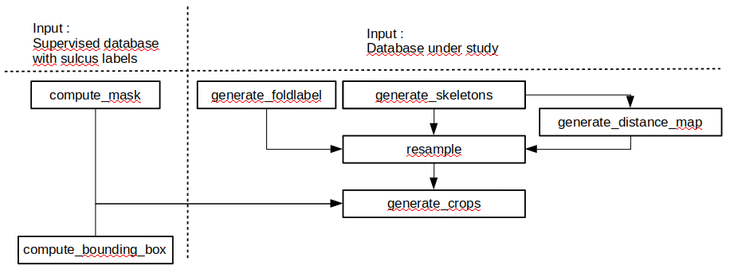

deep_folding.brainvisa
######################

This folder contains scripts that work with BrainVISA/Anatomist.

Step-by-step tutorial: generate a dataset
#########################################

The first part of the pipeline (first column of the figure) is using a manually labelled dataset.
In such a dataset, each sulcus is manually labelled. Names of the different sulci can be found as a json file at
`<https://github.com/brainvisa/brainvisa-share/blob/master/nomenclature/translation/sulci_default_list.json>`_, and they are represented in the brain here:

.. image:: https://brainvisa.info/web/_static/images/bsa/brainvisa_sulci_atlas_with_table_150dpi-r90.png
  :width: 600

The first step is to generate for each sulcus of interest a bounding box (compute_bounding_box.py) and a mask (compute_mask.py) that encompass the given sulcus for all subjects of the manually labelled dataset.

The second step is then to generate crops (generate_crops.py) in the target dataset (for example `HCP http://www.humanconnectomeproject.org/>`_) using different combinations of masks and/or bounding boxes. For visualization, we generate each crop as nifti file; in order to provide the deep learning program with an appropriate input, we combine all volumes in a dataframe and save it as a pickle file.

When generating crops, sulci can be regrouped in different overlapping regions. We have subdivided the brain in different overlapping regions as a json file at `<https://github.com/brainvisa/brainvisa-share/blob/master/nomenclature/translation/sulci_regions_overlap.json>`_.

Compute a sulcus-specific bounding box
======================================

We start by computing, for each sulcus, bounding boxes and masks.
For this, we are using a manually labelled database. At the end of the program,
we will have a bounding box that encompasses the sulcus with the given name
for all subjects. 

We suppose that we have already installed brainvisa singularity image 
as well as the deep_folding module following the steps described in `<../../README.rst>`_

We first need to enter in the brainvisa singularity bash:

.. code-block:: shell

   bv bash

We then define the parameters to launch the computation of the bounding box:

.. code-block:: shell

   # We change the following variable with our manually labelled dataset.
   # This one is the one used at Neurospin:
   SRC_DIR_SUPERVISED=/neurospin/dico/data/bv_databases/human/pclean/all
   
   # Global output directory where to store the files
   # We change this to the desired output directory
   OUTPUT_DIR=/neurospin/dico/data/deep_folding/test
   
   # Hemisphere side
   SIDE=R
   # Output voxel size
   VOXEL_SIZE=2.0
   # Folder in which to write the results
   # Note that bounding bpxes will be written in the subfolder $SIDE
   BBOX_DIR=${OUTPUT_DIR}/bbox/${VOXEL_SIZE}mm
   # sulcus name (without the _left or _right extension)
   SULCUS=F.C.M.ant.
   # Relative path of graph in the folder hierarchy of the subject
   PATH_TO_GRAPH=t1mri/t1/default_analysis/folds/3.3/base2018_manual

We then go to the deep_folding/brainvisa folder:

.. code-block:: shell

   cd deep_folding/brainvisa

We then determine the bounding box around the sulcus named SULCUS by launching the following command:

.. code-block:: shell

  python3 compute_bounding_box.py -s $SRC_DIR_SUPERVISED -o $BBOX_DIR -u $SULCUS -i $SIDE -p $PATH_TO_GRAPH -x $VOXEL_SIZE

This will create in the folder $BBOX_DIR three files 
(SIDE is now either 'left' or 'right'):

* ${SULCUS}_${SIDE}.json: a json file in the subfolder '/R' or '/L' (depending on the side) that contains the bounding box coordinates
* command_line_${SULCUS}_${SIDE}.sh: a bash file to reproduce the results (to be launched from deep_folding/brainvisa) 
* log_${SULCUS}_${SIDE}.log: a log file that contains the log of the command

We note that we can also change the sulcus name using the flag '-w'. Launch the help command for more information:

.. code-block:: shell

  python3 compute_bounding_box.py -h

Compute a sulcus-specific mask
==============================

We will now compute the mask encompassing the sulcus SULCUS:

We first define a mask folder to put the results of the mask:

.. code-block:: shell

   # Folder in which to write the mask results
   MASK_DIR=${OUTPUT_DIR}/bbox/${VOXEL_SIZE}mm

We then compute the mask:

.. code-block:: shell

  python3 compute_mask.py -s $SRC_DIR_SUPERVISED -o $MASK_DIR -u $SULCUS -i $SIDE -p $PATH_TO_GRAPH -x $VOXEL_SIZE

This will create in the folder $MASK_DIR four files 
(SIDE is now either 'left' or 'right'):

* ${SULCUS}_${SIDE}.nii.gz: a nifti file (and the header *.minf), in the subfolder '/R' or '/L' (depending on the side). This is the actual mask
* command_line_${SULCUS}_${SIDE}.sh: a bash file to reproduce the results (to be launched from deep_folding/brainvisa) 
* log_${SULCUS}_${SIDE}.log: a log file that contains the log of the command

Generate skeletons and foldlabels in the native space
=====================================================

We now generate skeletons and foldlabels from graph for the unsupervised target data set. Such a dataset can be for example the HCP database analyzed using morphologist.

We define relevant directories:

.. code-block:: shell

   # We change the following variable with the unsupervised dataset.
   # This variable points directly to the morphologist directory containing the subjects as subdirectories.
   # This one is the HCP dataset used at Neurospin:
   SRC_DIR_UNSUPERVISED=/neurospin/dico/data/bv_databases/human/hcp/hcp
   
   # Output directory where to put raw skeletons:
   SKELETON_DIR=${OUTPUT_DIR}/hcp/skeletons/raw
   
   # Output directory where to put raw foldlabels:
   FOLDLABEL_DIR=${OUTPUT_DIR}/hcp/foldlabels/raw
   
   # Relative path to graph for our HCP dataset
   PATH_TO_GRAPH_HCP=t1mri/BL/default_analysis/folds/3.1

We generate raw skeletons from graph, without resampling at this stage. Note the option '-a' that tells the program to parallelize computation. If the program fails, remove the option '-a' and add the option '-v' (verbose mode) to get more debug outputs:

.. code-block:: shell

    python3 generate_skeletons.py -s $SRC_DIR_UNSUPERVISED -o $SKELETON_DIR -i $SIDE -p $PATH_TO_GRAPH_HCP -a

In the same way, we generate raw foldlabel files:

.. code-block:: shell

    python3 generate_foldlabels.py -s $SRC_DIR_UNSUPERVISED -o $FOLDLABEL_DIR -i $SIDE -p $PATH_TO_GRAPH_HCP -a
  
Resample skeletons and foldlabels in the native space
=====================================================
 
We will now resample skeletons and foldlabels with the desired voxel size and in the ICBM2009c template. To avoid having to read graph files several times, we first compute the linear tranformation from the native space to the ICBM2009c space:

We first define the transform output directory where to store transform files, as well as the output directories where to store resampled skeleton and foldlabels files:

.. code-block:: shell

    # Output directory where to put transform files:
    TRANSFORM_DIR=${OUTPUT_DIR}/datasets/hcp/transforms

    # Output directories where to put resamples skeleton and foldlabels files:
    RESAMPLED_SKELETON_DIR=${OUTPUT_DIR}/datasets/hcp/skeletons/{VOXEL_SIZE}mm
    RESAMPLED_FOLDLABEL_DIR=${OUTPUT_DIR}/datasets/hcp/foldlabels/{VOXEL_SIZE}mm
  
We then generate transform files for the whole dataset:
 
.. code-block:: shell

    python3 generate_ICBM2009c_transforms.py -s $SRC_DIR_UNSUPERVISED -o $TRANSFORM_DIR -i $SIDE -p $PATH_TO_GRAPH_HCP -a
 
Using these transform files, we resample skeletons and foldlabels using resample_files.py:
 
.. code-block:: shell

    python3 resample_files.py -s $SKELETON_DIR -o $RESAMPLED_SKELETON_DIR -i $SIDE -y skeleton -t $TRANSFORM_DIR -x $VOXEL_SIZE -a
    python3 resample_files.py -s $FOLDLABEL_DIR -o $RESAMPLED_FOLDLABEL_DIR -i $SIDE -y foldlabel -t $TRANSFORM_DIR -x $VOXEL_SIZE -a
  
Crop generation
===============

We can now generate crops quickly as it is simply a mask or a crop of the resampled volume. We can combine sulci by just adding suylci in the sulcus list (see the help command for more information). We are now generating a crop based on the mask of a single sulcus named $SULCUS.

We first define the relevant output crop directory:

.. code-block:: shell

    CROP_DIR=${OUTPUT_DIR}/datasets/hcp/crops/${VOXEL_SIZE}mm/${SULCUS}/mask

We then generate skeleton crops and foldlabel crops. The effective mask is saved as ${SIDE}mask.nii.gz in the crop directory:

.. code-block:: shell

    python3 generate_crops.py -s $RESAMPLED_SKELETON_DIR -o $CROP_DIR -i $SIDE -y skeleton -k $MASK_DIR -u $SULCUS -c mask -a
    python3 generate_crops.py -s $RESAMPLED_SKELETON_DIR -o $CROP_DIR -i $SIDE -y foldlabel -k $MASK_DIR -u $SULCUS -c mask -a

pipeline.py
===========

You can use the pipeline.py program to do all the previous steps in one command line. The way it works is that it calls all the required functions to process the target dataset from graphs to crops.
/!\ Currently, if a step is already done (already existing skeletons for example) and the data stored at the right place, the program doesn't recompute it and use the existing data.

All the parameters required for the called functions need to be written in a json file, which is the only argument (with verbose) of the pipeline function.
/!\ Any change in the arguments of a called function needs to be passed on both the json file and the pipeline.py code itself.

Remark: a command line log is still computed with this method. The only difference is that the name of the normally called python file has "pipeline_" at the beginning. The parameters json file file is also copied to the crop directory.

Currently (last update on 09/02/2023) the arguments of the json file are the following:

- save_behavior: parameter to set how the generated files should be saved. Choose 'clear_and_compute' to delete potential already existing ones, choose 'best' to compute only subjects that don't already exist,
choose 'minimal' to call the functions only if the directory is missing or empty.
Remark: for the mask computation, it is always 'best' that is chosen.
Remark: 'clear_and_compute' should be used only if you want to recompute the whole pipeline for all subjects. 'best' should be preferred in other cases.
- side: 'R' for right hemisphere or 'L' for left hemisphere.
- out_voxel_size: float, same as others.
- region name: *pipeline specific* ; name of the target region in the brain_region_json.
- brain_region_json: *pipeline specific* ; path to a json containing brain regions, each one defined by a set of sulci.
- parallel: set to true to compute the whole pipeline in parallel mode.
- nb_subjects: int ; number of subjects to generate as crops. Set to -1 for all subjects.
- input_type: what kind of crops to produce. Either 'skeleton' (default), 'foldlabel' or 'distmap'.
- labeled_subject_dir: path to a labeled database, used to generate the mask of the target region.
- path_to_graph(_supervised): end of the path to graphs. Used to generate the masks (_supervised) or the skeletons.
- supervised_output_dir: Path where to store the supervised products of the pipeline, such as masks or bounding boxes.
- nb_subjects_mask: int ; number of labeled subjects used to generate the masks. Set to -1 for all subjects.
- graphs_dir: path where the graph files are stored.
- skel_qc_path: path to the csv file containing the hand-made quality checks. Used by generate_skeletons.
- nb_subjects_mask: int, used by compute_mask. Number of subjects used to compute the masks.
- output_dir: directory where the object is to be saved. If the file already exists, the program uses the already existing data and doesn't recompute it.
- junction: parameter of generate_skeletons and generate_foldlabels.
- bids: parameter of generate_skeletons and generate_ICBM2009c_transforms.
- new_sulcus: parameter of compute_mask.
- resampled_skel: parameter of generate_distmaps.
- cropping_type: parameter of generate_crops.
- combine_type: parameter of generate_crops.
- no_mask: parameter of generate_crops.